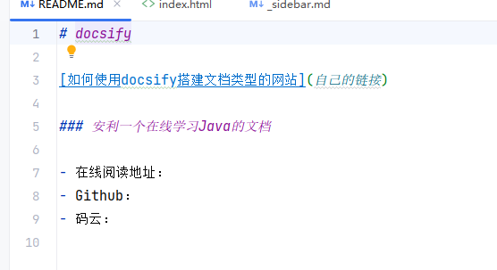

# 搭建一个文档类型网站

这篇文章是搭建一个像下面这样的文档类型的网站，可以用来当做项目的说明文档，也还可以当做自己专属的知识小仓库。


### 前置条件

1. 确保自己电脑下载安装了 npm 并且使用这个命令 ：npm i docsify-cli -g  全局安装 docsify-cli 这个工具。

2. 确保自己有一个 GitHub 账号和 Gitee 账号(码云为非必选项)。

# 初始化项目并预览

1. 新建一个文件夹：\**`mkdir docsify`**

2. 进入文件夹并运行 docsify 初始化命令：\****`cd docsify-demo`** **->** **`docsify init ./`**

   然后文件夹里多了以下内容 ：

   

3. 本地启动项目并预览 ：\****`docsify serve ./`** **然后访问：\****`http://localhost:3000/`**

   

# 给项目添加功能

### 修改配置文件 index.html

主要配置了文档网站的名字以及开启了一些配置选项。

```html
<!DOCTYPE html>
<html lang="en">
<head>
  <meta charset="UTF-8">
  <title>decsify</title>
  <meta http-equiv="X-UA-Compatible" content="IE=edge,chrome=1" />
  <meta name="description" content="Description">
  <meta name="viewport"
        content="width=device-width, user-scalable=no, initial-scale=1.0, maximum-scale=1.0, minimum-scale=1.0">
  <link rel="stylesheet" href="//unpkg.com/docsify/lib/themes/vue.css">
</head>
<body>
  <div id="app"></div>
  <!-- docsify-edit-on-github -->
  <script src="//unpkg.com/docsify-edit-on-github/index.js"></script>
  <script>
    window.$docsify = {
      name: 'docsify', /* 名称 */
      repo: 'https://github.com/Snailclimb/JavaGuide-Interview', /* 修改 */
      maxLevel: 5,//最大支持渲染的标题层级
      subMaxLevel: 3,
      homepage: 'README.md',
      coverpage: true, // 开启封面
      loadSidebar: true, // 开启侧边栏
      auto2top: true,//切换页面后是否自动跳转到页面顶部
    }
  </script>
  <!-- Docsify v4 -->
  <script src="//unpkg.com/docsify/lib/docsify.min.js"></script>
</body>
</html>
```
### 开启侧边栏

在第一步中，我们在已经开启了侧边栏选项：

```html
loadSidebar: true
```

但是，仅这样还不行，还要创建一个名为 `_sidebar.md`的文件，文件的内容就是我们侧边栏的内容，具体的内容.md一般建议将文档放进 docs 文件下面。


修改完成之后，你就会发现我们的文档网站多了侧边栏，你点击侧边栏对应的内容在右边显示。


### 修改主页内容

修改 README.md，内容如下：



然后我们的文档网站的主页就变成了这样：


### 添加一个封面

第一步中，我们在已经开启了封面选项：

```html
coverpage: true
```

为了能让我们的文档网站有封面，我们还需要新建一个名字为 `_coverpage.md`的文件，内容如下 ：

```html
<p align="center">

</p>
<h1 align="center">Shmily</h1>
- 本文档是作者折腾```docsify```以来的学习历程<br>也是平时学习Java的一些记录。<br>
如果本文能为您提供帮助，请给予支持!

[]
[常用资源](docs/the-cover/resource.md)
[GitHub](https://github.com/shmily0021)
[开始阅读](./README.md)

```

然后，我们再打开网站的时候，就有了封面，如下图所示：


# 插件


### Java代码高亮

手动引入 Java 代码高亮的插件：引入之后直接打开页面就生效了

```html
<!--Java代码高亮-->
<script src="//unpkg.com/prismjs/components/prism-java.js"></script>
```

### 增加全文搜索功能

引入插件 ：

```html
<!--全文搜索,直接用官方提供的无法生效-->
<script src="https://cdn.bootcss.com/docsify/4.5.9/plugins/search.min.js"></script>
```

配置一下 ：

```
window.$docsify = {
     
      // 配置全文搜索
      search: {
        //maxAge: 86400000, // 过期时间，单位毫秒，默认一天
        paths: 'auto',
        placeholder: '搜索',
        noData: '找不到结果',
        // 搜索标题的最大程级, 1 - 6
        depth: 3,
      },
```

然后我们的文档网站就有全文搜索功能了


### 复制代码到剪切板

引入插件即可！

```html
<!-- 复制代码到剪贴板 -->
<script src="//unpkg.com/docsify-copy-code"></script>
```


### 图片缩放和字数统计

引入下面两个插件即可！

```html
<!-- 图片缩放 -->
<script src="//unpkg.com/docsify/lib/plugins/zoom-image.js"></script>
<!-- 字数统计 -->
<script src="//unpkg.com/docsify-count/dist/countable.js"></script>
```


### Edit on github

做如下配置，注意修改为你自己的路径。（没测试成功）

```html
<script>
    window.$docsify = {
      plugins: [
        EditOnGithubPlugin.create('https://github.com/Snailclimb/JavaGuide-Interview/blob/master/')
      ],
    }
  </script>
```

然后我们的每个页面都出来了 "Edit on github" 选项，你点击之后就会跳到 Github 对应的页面编辑。

# 部署

### 部署到 GitHub

1. Github 新建一个仓库，这一步就不说了。

2. 把项目提交上去

3. 开启 Github Pages

### 同步到 Gitee 提高访问速度

1. 导入 GitHub 项目，并设置成开源。


2. 选择 Gitee Pages 服务 --> 勾选强制使用Https


3. 收获成功的喜悦


> The end

